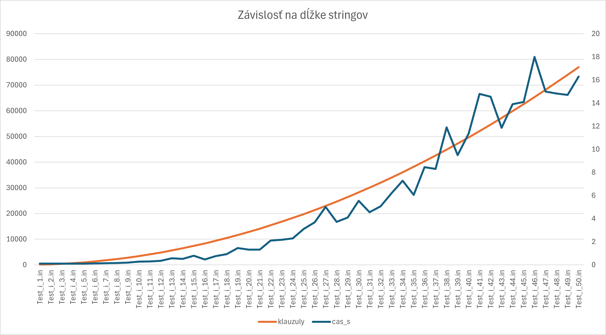

# Superstring solver
Toto je projekt ktorý pomocou SAT solvera *glucose* rieši problém existencie superstringu. 

## Zadanie
>Name: Shortest Common Superstring [SR9] 3

>Input: A finite set R={r1,r2,...,rm} of binary strings (sequences of 0 and 1); positive integer k.

>Question: Is there a binary string w of length at most k such that every string in R is a substring of w, i.e. for each r in R, w can be decomposed as w=w0rw1 where w0, w1 are (possibly empty) binary strings?

## Obsah riešenia
Riešenie je obsiahnuté v python súbore ```superstring.py```

V tomto súbore je python script ktorý zakóduje problém daný na vstupe do formy DIMACS CNF ktorú následne pošle do ```Glucose```. Výstup z tohto programu následne interpretuje do užívateľsky prívetivej formy. 

## Užíveľská dokumentácia, alias návod na používanie

**Táto časť je prebraná zo vzorového riešenia, od pána doktora Jiřího Švancaru Mgr. Ph.D.**

Používanie programu: 
```
superstring.py [-h] [-i INPUT] [-o OUTPUT] [-s SOLVER] [-v {0,1}]
```

Command-line options:

* `-h`, `--help` : Show a help message and exit.
* `-i INPUT`, `--input INPUT` : The instance file. Default: "test-input.in".
* `-o OUTPUT`, `--output OUTPUT` : Output file for the DIMACS format (i.e. the CNF formula). Default: "formula.cnf"
* `-s SOLVER`, `--solver SOLVER` : The SAT solver to be used. Default: "glucose".
* `-v {0,1}`, `--verbosity {0,1}` : Verbosity of the SAT solver used. Default: 0.

-- <cite>Švancara Jiří Mgr. Ph.D.<cite>

Kde vstupný súbor by mal byť v tomto formáte:

```
15
101101
011011
110111
010101
```
>15 = k 

nasledujú jednotlivé stringy

A výstup je buď ```No solution found``` alebo ```Superstring: {nájdený vhodný superstring}```

## Encoding 
Celý problém je založený na tom že "hľadáme" daný string v superstringu - to znamená že môže byť posunutý na rôznych pozíciách. Zároveň musíme zariadiť, že v našom supestringu nájdeme všetky stringy. Taktiež je dôležité aby sme pri každom posunutí stringu kontrolovali všetky bity. 

Výsledná logická formula vyzerá takto:
$$
\bigwedge_{i=1}^{m}
\left(
    \bigvee_{p=0}^{\,k - r_i}
    \left(
        \bigwedge_{j=0}^{\,r_i-1}
            L_{i,p,j}
    \right)
\right)
$$

Kde: 
* $m$ je počet stringov na vstupe
* $k$ je maximálna dĺžka superstring
* $r_i$ je i-ty string na vstupe
* $p$ je aktuálne posunutie - preto najväčšie možné posunutie stringu je $k-r_i$
* $L_{i,p,j}$ je literál $v_{j+p}$ ak $r_i[j]=1$, a literál $\neg v_{j+p}$ ak $r_i[j]=0$.
* $v_i$ je i-ty bit výsledku

Prvých $k$ premenných sú premenné výsledného supestringu, preto sa môžeme na to v rámci $L_{i,p,j}$ odvolať, v závislosti od toho či potrebujeme $0 \rarr \neg$ alebo $1$

#### Jednotlivé časti formule a ako ich program kóduje:
$$Match(r_i, p) \harr \bigwedge_{j=0}^{\,r_i-1}L_{i,p,j}$$
Túto časť formule sme vyjadrili ako premennú $Match$ aby sme ju v následnej disjunkcii mohli správne zakódovať do DIMACS CNF. Túto časť definujeme ako premennú (je to simulácia dynamického programovania) - vždy keď potrebujeme vytvoriť túto premennú, tak si index premenných posunieme o jedna a zapamätáme si že na danom indexe existuje táto premenná. 

Následne jej pravdivostnú hodnotu zakódujeme do DIMACS CNF:

*Kde medzi všetkými riadkami je $\land$* 

$\bigwedge_{j=0}^{\,r_i-1}L_{i,p,j} = l_1 \land l_2 \land \dots \land l_i$

$$m_{i,p} \lor l_1 \\
m_{i,p} \lor l_2\\
 \dots \\
m_{i,p} \lor l_i\\
\neg l_1 \lor \neg l_2 \lor \dots \lor \neg l_i \lor m_{i,p}$$

Potom môžeme túto premennú používať v ďalších častiach formule. Teraz vieme formulu prepísať takto:

$$
\bigwedge_{i=1}^{m}
\left(
    \bigvee_{p=0}^{\,k - r_i}
    Match(r_i, p)
\right)
$$

Tým že $\bigwedge_{i=1}^{m}$ vlastne vyriešime tým že prejdeme všetky stringy (riešenie jedného stringu je v nasledujúcom $\bigvee$) a rozdelíme to na jednotlivé riadky medzi ktorými je $\land$ tak je to vyriešené

$$
\bigvee_{p=0}^{\,k - r_i}
    Match(r_i, p)
$$
Keďže sme jednotlivé posunutie popísali vo funkcii $Match$, tak už iba musíme zariadiť že sa daný string $r_i$ vyskytne v danom superstringu aspoň raz. To je vyriešené týmto $\bigvee$. Prechádza to všetky možné posunutia stringu a pomocou funkcie/premennej $Match$ to zisťuje či sa to v danej chvíli zhoduje (môže sa to zhodovať aj viackrát)


Toto je v DIMACS CNF zakódované týmto spôsobom:

*i je fixované pre daný string*

$$m_{i,0} \lor m_{i,1} \lor \dots \lor m_{i,k-r_i} $$

A toto sa teda opakuje s rôznymi i *viď. vysvetlenie $\bigwedge$*


## Testovanie: 
Z môjho testovania vyšlo že samostatné $k$ má minimálny až žiadny vplyv na zložitosť, preto sa skôr zamerám na dĺžku a počet stringov (z čoho by podľa mňa mali vyjsť zaujímavejšie výsledky) 

Graf 1: Počet stringov vs čas riešenia (dĺžka stringov=10) počet stringov rastie vždy o 1

Graf 2: Dĺžka stringov vs čas riešenia (počet stringov=10) dlžka stringov rastie vždy o 1


Vidíme že čas aj počet klauzúl rastie exponenciálne s počtom stringov aj s dĺžkou stringov. Pričom počet stringov má väčší vplyv na zložitosť ako dĺžka stringov.